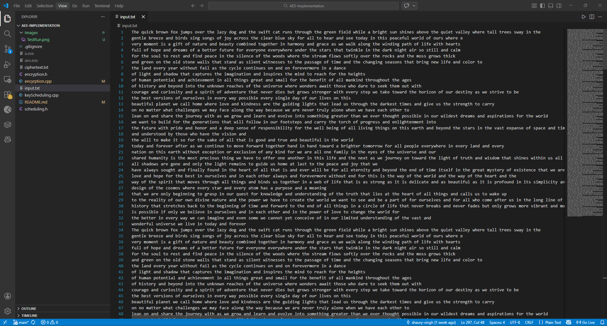
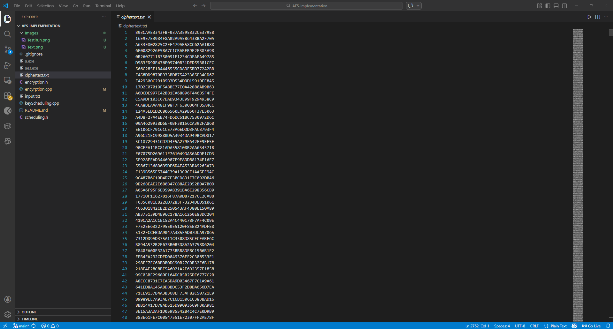
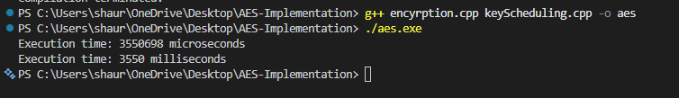

# AES-128 Encryption Implementation (C++)

A from-scratch implementation of the **AES-128 encryption algorithm in C++**.
The program reads plaintext from a file, encrypts it using AES-128, and writes the ciphertext to another file.

---

# Features

* Full AES-128 encryption pipeline
* Key Expansion (Key Scheduling)
* File-based input/output
* Implemented without external cryptographic libraries
* Modular C++ design

---

# Project Structure

```
.
├── encryption.cpp
├── encryption.h
├── keyScheduling.cpp
├── scheduling.h
├── input.txt
├── ciphertext.txt
└── images
```

---

# Input File

The user writes plaintext inside **input.txt**.



---

# Output Ciphertext

After encryption, the ciphertext is written to **ciphertext.txt** in hexadecimal form.



---

# Compilation

Both source files must be compiled together:

```bash
g++ encryption.cpp keyScheduling.cpp -o aes
```

---

# Running the Program

```bash
./aes
```

Example execution:



`Encryption Time: ~3550 ms for large plaintext input`

---

# AES-128 Details

AES-128 uses:

* **128-bit key**
* **128-bit block size**
* **10 rounds of encryption**

Each round consists of:

1. SubBytes
2. ShiftRows
3. MixColumns
4. AddRoundKey

Round keys are generated using the **AES Key Expansion Algorithm** implemented in `keyScheduling.cpp`.

---

# Author

Shaury Singh
